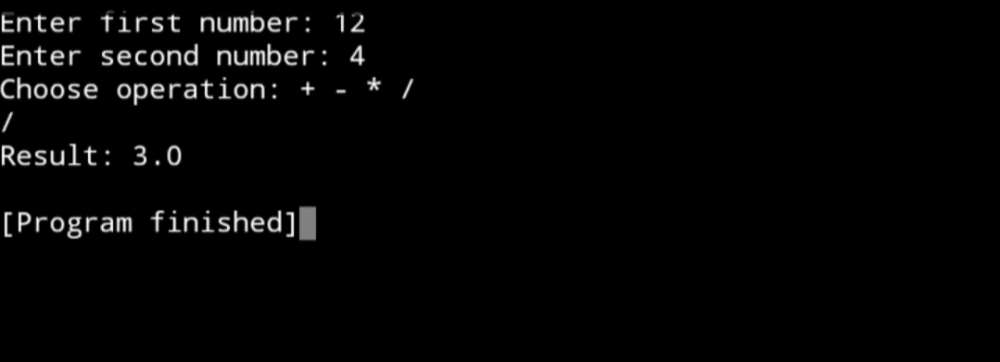

# SKILL-CRAFT-TECHNOLOGY-task2
Java
# SKILL-CRAFT-TECHNOLOGY – Task 2

🚀 **Internship Role:** Software Development Intern  
🏢 **Organization:** Skillcraft Technology  
🖥️ **Language Used:** Java  
📁 **Task Name:** Task 2 – [Brief description goes here]

---

## 📌 Task Objective

This task is part of my internship under Skillcraft Technology. The goal of this assignment is to apply core Java concepts to solve a given problem efficiently.

## 🛠️ Technologies Used

- Java (JDK 8 or above)
- IDE: IntelliJ IDEA / Eclipse / VS Code
- Git & GitHub for version control

## 📄 Files Included

- `Task2.java` – Main source code for Task 2  
- `Screenshot_2025-07-29-13-47-15-52.jpg` – Output or program execution screenshot  
- `README.md` – Project documentation

## ✅ Output

---

## 🔗 About the Internship

This task is a part of the virtual internship program provided by **Skillcraft Technology**, where I am working as a **Software Development Intern**. Through this internship, I’m gaining hands-on experience in Java programming and real-world software development practices.

---

## 📬 Contact

If you have any questions or suggestions, feel free to connect:

👤 **Aravind Kumar**  
📧 aravindkumar06062006@gmail.com  
🌐 [LinkedIn](https://www.linkedin.com/in/aravind-kumar)  
🔗 [GitHub Profile](https://github.com/ARAVINDKUMARGS)

---

## ⭐ GitHub Stats

If you find this task interesting, feel free to star ⭐ the repository and follow for more!
